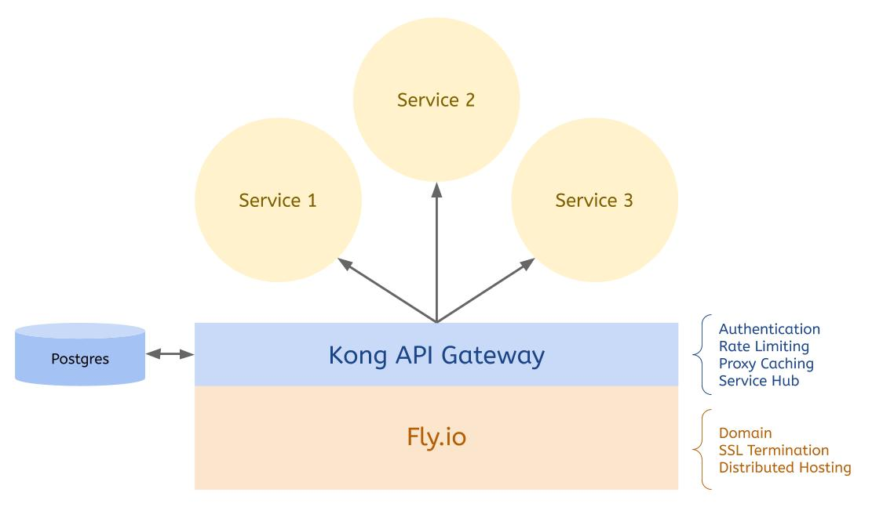

# Running a Kong API Gateway on Fly.io
Microservices have gained widespread adoption in the past decade, but they present their own set of challenges. Traffic control, authentication, logging, and rate limiting are essential in distributed architectures, but not easy to manage when your organization runs dozens or hundreds of APIs.

[Kong](https://konghq.com/kong/) provides an excellent solution to these problems. It's an open-source API gateway that sits between your users and backend services. By proxying requests through Kong, you can enforce standardized authentication rules, log requests and errors, and even transform data on the fly.

Kong can be deployed to a central server, but this slows down your application because all your web requests must pass through a central location before being sent to your backing services. Fortunately, you can take advantage of [Fly's edge hosting model](https://fly.io/) to improve performance by serving Kong on Fly's globally distributed network.



## How to Deploy a Kong API Gateway to Fly
In this tutorial, you'll see how to deploy a Kong API Gateway to Fly.io. You'll expose the free [JSON Placeholder](https://jsonplaceholder.typicode.com/) as a backend service and use Kong to add rate limiting and API key authentication. Finally, you'll see how to lock down the Kong Admin API so that only authenticated users can access it. You'll see all the steps required in this tutorial, but if you'd like to download the final working application, it's [available on Github](https://github.com/karllhughes/fly-kong).

### Prerequisites
- [Flyctl command line tool](https://fly.io/docs/flyctl/installing/).
- [A Postgres database](https://www.postgresql.org/) that is publicly available and allows connections (I created one on [Heroku](https://devcenter.heroku.com/articles/heroku-postgresql)). Kong will use this as a central data store.
- [Docker](https://www.docker.com/products/docker-desktop) for running the one-time Kong database migrations.

### Creating a New Fly Application
First, you'll need to use `flyctl` to create a new application. If you haven't already, install the appropriate version of `flyctl` for your operating system using the [instructions here](https://fly.io/docs/hands-on/installing/).

Next, [sign up](https://fly.io/docs/hands-on/sign-up/) or [sign in](https://fly.io/docs/hands-on/sign-in/) to your Fly account via the command line:

```bash
# Sign up
flyctl auth signup

# Or sign in
flyctl auth login
```

You will be directed to a web page that will allow you to log in using your Github account or email and password.

Create a new directory called `fly-kong` and create your new app inside of it:

```bash
mkdir fly-kong && cd fly-kong
flyctl apps create
```

Use the auto-generated app name, select your organization, and select `Dockerfile` as your builder. You should see output similar to this in your console:

```bash
? App Name (leave blank to use an auto-generated name) 

? Select organization: YOUR ORGANIZATION

? Select builder: Dockerfile
    (Create an example Dockerfile)

New app created
  Name     = <your-app-name>  
  Owner    = <your-name>
  Version  = 0               
  Status   =                 
  Hostname = <empty>         

Wrote config file fly.toml
```

Fly will create a `fly.toml` file and `Dockerfile` in the root of your project.

Open the `fly.toml` file and modify the `[[services]]` portion:

```toml
...
# Kong Gateway
[[services]]
  internal_port = 8000
  protocol = "tcp"

  [[services.ports]]
    handlers = ["tls", "http"]
    port = "443"

# Kong Admin
[[services]]
  internal_port = 8001
  protocol = "tcp"

  [[services.ports]]
    handlers = ["tls", "http"]
    port = "10001"
```

This will open two ports on your Fly deployment. The first handles standard SSL traffic and routes it to the Kong API Gateway, and the second handles traffic to port `10001`, which you'll use for the [Kong Admin API](https://docs.konghq.com/2.0.x/admin-api/).

Because of the [filesystem permissions required for writing to the `/dev/std*` logs](https://github.com/moby/moby/issues/31243), you need to run the container as `root`. Open up the `Dockerfile` and replace it with the following:

```Dockerfile
FROM kong:latest
USER root
```

Your application configuration is now ready, but you still need to set up the database before you can run Kong.

### Preparing Your Database
Before you can use your Kong API Gateway, you'll need run the [Kong database migrations](https://docs.konghq.com/install/docker/). You can do this using Docker:

```bash
docker run --rm \
     -e "KONG_DATABASE=postgres" \
     -e "KONG_PG_HOST=<database-host>" \
     -e "KONG_PG_DATABASE=<database-name>" \
     -e "KONG_PG_PORT=<database-port>" \
     -e "KONG_PG_USER=<database-user>" \
     -e "KONG_PG_PASSWORD=<database-password>" \
     -e "KONG_PG_SSL=on" \
     kong:latest kong migrations bootstrap
```

Kong uses this database to persist data about your Services, Routes, and Consumers across the Fly hosting network. Once the database migrations have run, you're ready to start Kong on Fly.

### Starting Kong
Your Fly instance will connect to the Postgres database you prepared in the previous step, but first, you need to add your database connection credentials to Fly as [application secrets](https://fly.io/docs/flyctl/secrets/).

Run the following in your terminal:

```bash
flyctl secrets set \
	KONG_DATABASE="postgres" \
	KONG_PG_HOST="<database-host>" \
	KONG_PG_DATABASE="<database-name>" \
	KONG_PG_PORT="<database-port>" \
	KONG_PG_USER="<database-user>" \
	KONG_PG_PASSWORD="<database-password>" \
	KONG_PG_SSL="on" \
	KONG_PROXY_ACCESS_LOG="/dev/stdout" \
	KONG_ADMIN_ACCESS_LOG="/dev/stdout" \
	KONG_PROXY_ERROR_LOG="/dev/stderr" \
	KONG_ADMIN_ERROR_LOG="/dev/stderr" \
	KONG_ADMIN_LISTEN="0.0.0.0:8001"
```

This command adds the database connection, logging, and admin API details to your Fly environment. Now you're ready to deploy Kong:

```bash
flyctl deploy
```

You should see output similar to the following in your terminal:

```
Deploying <your-app-name>
==> Validating App Configuration
--> Validating App Configuration done
Services
TCP 443 ⇢ 8000   
TCP 10001 ⇢ 8001 

Deploy source directory '/Users/karl/fly-kong'
Docker daemon available, performing local build...
==> Building with Dockerfile
Using Dockerfile: /Users/karl/fly-kong/Dockerfile
...
--> Done Pushing Image
==> Optimizing Image
--> Done Optimizing Image
==> Creating Release
Release v26 created
Monitoring Deployment
You can detach the terminal anytime without stopping the deployment

1 desired, 2 placed, 1 healthy, 0 unhealthy
--> v1 deployed successfully
```

You can visit your newly created Kong deployment at `https://<your-app-name>.fly.dev`, but all you'll see is the message, "no Route matched with those values." In the next section, you'll see how to set up Services, Routes, and Plugins using the Kong Admin API.

## Using Kong to Secure an API
You have a working instance of Kong deployed to Fly, but it's not useful without any [Services or Routes](https://docs.konghq.com/2.0.x/getting-started/configuring-a-service/). In this section, you'll see how to add a Service and configure rate limiting and API key authentication. Finally, you'll secure the Kong Admin API to prevent unauthorized access to your Gateway's configuration.

### Adding a Backend Service
Kong will proxy web requests it receives to any backend API you set up. To demonstrate this functionality, you'll create a new service that proxies requests to [JSON Placeholder](https://jsonplaceholder.typicode.com/). This free service returns a JSON payload similar to what you might find when connecting to a REST API.

To add JSON Placeholder's `/posts` resource as a service named `posts`, use [curl](https://curl.haxx.se/) to post it to the Kong Admin API:

```bash
curl -i -X POST https://<your-app-name>.fly.dev:10001/services \
 --data name=posts \
 --data url='https://jsonplaceholder.typicode.com/posts'
```

Next, create a Route in Kong. Routes specify access points for your services, so in this case, the route will be `/posts`, and it will act as a proxy for the `posts` Service you just created:

```bash
curl -i -X POST https://<your-app-name>.fly.dev:10001/services/posts/routes \
  --data 'paths[]=/posts'
```

Kong's Admin API gives you REST access to all the Kong resources saved in the database, so be sure to [check out the documentation](https://docs.konghq.com/2.0.x/admin-api/) to learn more.

Now that you have a Route connected to a Service, you can test it out on your deployment. Visit `https://<your-app-name>.fly.dev/posts` to see the `/posts` payload from JSON Placeholder:

```json
[
  {
    "userId": 1,
    "id": 1,
    "title": "sunt aut facere repellat provident occaecati excepturi optio reprehenderit",
    "body": "quia et suscipit\nsuscipit recusandae consequuntur expedita et cum\nreprehenderit molestiae ut ut quas totam\nnostrum rerum est autem sunt rem eveniet architecto"
  },
  ...
```

You can also retrieve the access logs using `flyctl logs`.

### Rate Limiting Access
If you're exposing your API publicly, rate limiting your users is probably a good idea. You can use [Kong's Rate Limiting plugin](https://docs.konghq.com/getting-started-guide/ce-2.0.x_ke-1.5.x/protect-services/) to ensure that users can't abuse your API by repeatedly calling the same endpoint. This encourages users to cache responses and can save significant load on your servers.

To add the Rate Limiting plugin, use the Kong Admin API again:

```bash
curl -i -X POST https://<your-app-name>.fly.dev:10001/services/posts/plugins \
--data "name=rate-limiting" \
--data "config.minute=5" \
--data "config.policy=local"
```

The policy above restricts users to 5 API calls per minute per node. You could also limit users to a certain number of API calls for all nodes, but this requires storage in the central database. Since Fly is directing requests to the nearest node anyway, `local` is fine for this use case.

To test the rate limiting out, go to `https://<your-app-name>.fly.dev/posts` in your browser and hit refresh six times in a row. On the 6th refresh, you should see the message, "API rate limit exceeded."

### API Key Authentication
If your API is only going to be used by trusted consumers, you should limit access using API Keys or [another form of authentication](https://docs.konghq.com/2.0.x/auth/). To add authentication to the `/posts` Route, you can use curl again to post to the Kong Admin API:

```bash
curl -i -X POST \
   --url https://<your-app-name>.fly.dev:10001/services/posts/plugins/ \
   --data 'name=key-auth'
   --data 'config.hide_credentials=true'
```

To test this out, you'll also need a [Consumer](https://docs.konghq.com/2.0.x/getting-started/adding-consumers/) with an API key. Create a user called `admin` using the Kong Admin API:

```bash
curl -i -X POST \
   --url https://<your-app-name>.fly.dev:10001/consumers/ \
   --data "username=admin"
```

And add an API Key:

```bash
curl -i -X POST \
   --url https://<your-app-name>.fly.dev:10001/consumers/admin/key-auth \
   --data ""
```

Copy the `key` that Kong returns as you'll need it to test out the API Key authentication.

To test that authentication is working, refresh `https://<your-app-name>.fly.dev/posts` in your browser. You should get a message saying, "No API key found in request."

Next, add your API Key as a querystring parameter called `apikey`. For example, `https://<your-app-name>.fly.dev/posts?apikey=<your-api-key>`.

This time, you should see the list of posts returned in the previous steps. Kong is now protecting your posts Service, but your Admin API is still publicly exposed. This means anyone who knows your URL and port could create Consumers or redirect your Services to their backend.

### Securing the Kong Admin API
Kong provides several methods for [securing the Admin API](https://docs.konghq.com/2.0.x/secure-admin-api/), but the simplest in a distributed hosting environment like this is to use a [loopback](https://docs.konghq.com/2.0.x/secure-admin-api/#kong-api-loopback). Because Kong can secure any service, you can use Kong to secure its own Admin API.

First, add a new service called `admin-api` which points to `localhost:8001`:

```bash
curl -i -X POST https://<your-app-name>.fly.dev:10001/services \
	--data "name=admin-api" \
	--data "host=localhost" \
	--data "port=8001"
```

And a new Route to access this service:

```
curl -i -X POST https://<your-app-name>.fly.dev:10001/services/admin-api/routes \
  --data 'paths[]=/admin-api'
```

As you did in the previous step, add the API Key plugin to restrict this service to authenticated consumers:

```bash
curl -i -X POST \
   --url https://<your-app-name>.fly.dev:10001/services/admin-api/plugins/ \
   --data 'name=key-auth' \
   --data 'config.hide_credentials=true'
```

You can now access the Kong Admin API openly at `https://<your-app-name>.fly.dev:10001` or using a valid API key at `https://<your-app-name>.fly.dev/admin-api?apikey=<your-api-key>`. To shut off open access, you just need to update your `fly.toml` file and re-deploy Kong.

Remove the Kong Admin portion of the `fly.toml` file:

```toml
...
# Remove this:
[[services]]
  internal_port = 8001
  protocol = "tcp"

  [[services.ports]]
    handlers = ["tls", "http"]
    port = "10001"
```

And deploy Kong again:

```bash
flyctl deploy
```

Once your API Gateway is running again, you'll only be able to access the Admin API through `https://<your-app-name>.fly.dev/admin-api?apikey=<your-api-key>` with a valid API key.

## Conclusion
In this post, you've seen how to use Kong API Gateway to add rate limiting and API key authentication to your backend services. You've deployed Kong to Fly's distributed hosting platform to take advantage of their global network and secured your Kong Admin Portal to limit access. If you're looking to add more functionality to your gateway, be sure to [check out the Kong Plugins directory](https://docs.konghq.com/hub/).

If you have any questions about using Kong with [Fly.io](https://fly.io/), be sure to reach out so we can help you get started.
